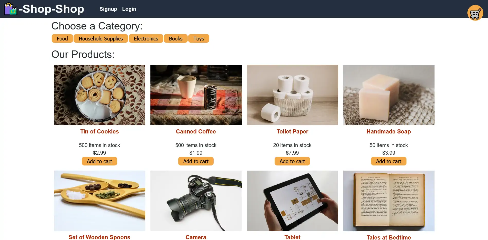

# Shop Shop

## Description 

Shop Shop is a mock e-commerce site where users can create accounts and make purchases. Built with React, Redux and Apollo GraphQL.

---

## Table of Contents 

- [Website](#website)
- [Built With](#built-with)
- [Usage](#usage)
- [Contributors](#contributors)
- [Acknowledgements](#acknowledgements)

---

## Website

https://craigs-shop-shop.herokuapp.com/

---

## Built With

[Back to Contents](#table-of-contents)

---

## Usage

Use the link below to check out the site. You can add items to the cart, and they will persist in your browser's storage if you leave the site and come back. Create an account to use the "purchase" feature which is in testing mode. You don't have to provide a real email address, but it does have to be in a valid email format. Use 4242 4242 4242 4242 as your card number. The "purchase" is made through Stripe (NOT A REAL PURCHASE).

[Back to Contents](#table-of-contents)
  
---

## Contributors

---
---
    
### Craig Bennett

- Converted this app from React Context API to Redux.
    
[Craig5117](https://github.com/Craig5117)

---
---

[Back to Contents](#table-of-contents)

## Acknowledgements

* [jsonwebtoken](https://www.npmjs.com/package/jsonwebtoken)
* [Stripe] (https://stripe.com/)
* [apollo-server-express](https://www.npmjs.com/package/apollo-server-express)
* [Tech badges by Ileriayo](https://github.com/Ileriayo/markdown-badges)
* Google Books API

[Back to Contents](#table-of-contents)

---